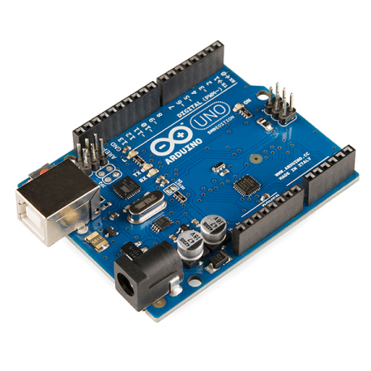
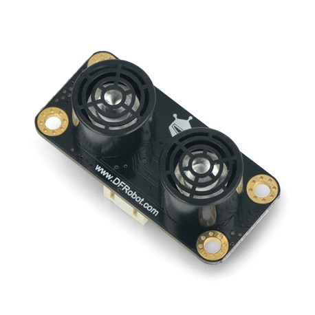
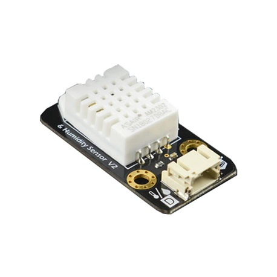
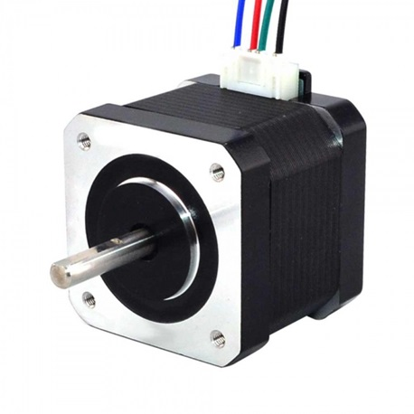
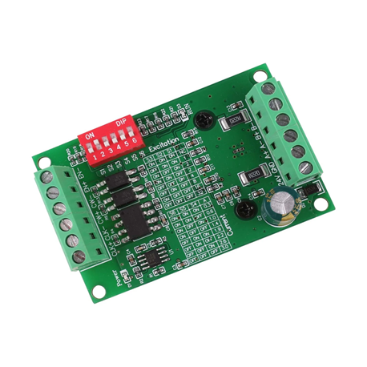
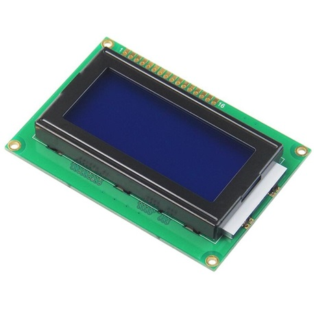

# PetAI - Stray Feeder

"Feeding Hearts, Paving Paths: Building a Better World for All Beings."

[//]: # (![logo]&#40;photos/logo.png&#41;)
# Abstract
The "PetAI" project develops an innovative animal care system that combines 
artificial intelligence with human compassion. At its core is the automatic 
feeder, which not only provides food to stray animals but also functions as 
a lost pet detection system. Passersby can contribute a small amount to 
activate the feeder while simultaneously assisting in the search for lost 
animals in their area.

The system includes the use of motors, motion sensors, etc., for animal detection. 
Additionally, it incorporates a high-resolution camera for capturing and analyzing 
images of the animals. The system features an integrated data management system 
for storing and retrieving information regarding pet activity and the captured 
photos. Necessary communications are conducted via a RESTful API, allowing 
interaction and data exchange with other applications and services.

[//]: # (![feeder]&#40;photos/photo1.jpg&#41;)

# Parts
**PetAI** is a multi-sensor system, each mainly consisting of two parts:

### Programming and Production Boards
Here you can notice the 2 main boards used to make this project working

|           Arduino Board            |           ESP32 - CAM            |
|:----------------------------------:|:--------------------------------:|
|  |  |

### Sensors
|            Gravity Ultrasonic Sensor             | Gravity Temperature & Humidity Sensor |
|:------------------------------------------------:|:-------------------------------------:|
|  |     |

### Components
|           Nema 17            |   TB6560 - Stepper Driver    |            16x4 LCD             |
|:----------------------------:|:----------------------------:|:-------------------------------:|
|  |  |  |
